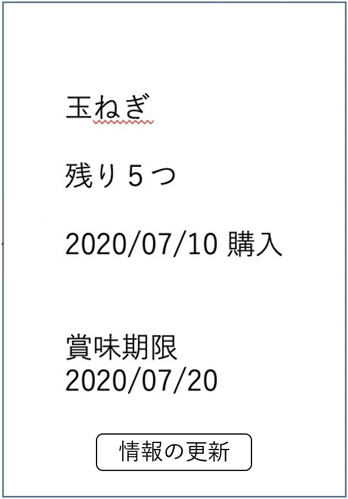

# ユースケース: 食材の情報を更新する

## 概要
ユーザが食材の情報を更新する.

## アクター
ユーザ

## 事前条件
システムが食材の詳細情報画面を表示している.

## 事後条件
食材の数量・賞味期限・購入日・使用日等のいずれかの修正, または食材の使用による数量変更の更新.

## トリガー
ユーザが, 食材の詳細情報画面で「情報の更新」ボタンを押す.

## 基本フロー
1. ユーザが, ある食材の詳細情報画面で「情報の更新」ボタンを押す.
2. システムは, その食材の情報の変更フォーム画面を表示する.
3. ユーザは, 変更したい情報を書き換え, 「確定」ボタンを押す.
4. システムは, 数量が負の値になっていないか, 使用日が購入日より前になっていないかチェックする.
5. チェックOKなら, システムは食材の情報を変更し, システムに保存, 食材の詳細情報画面を表示する.

## 代替フロー
### 代替フロー1
- 3a.1 基本フロー3において, 食材を使用して変動した数量を反映する場合, ユーザは, 使用履歴のフォーム左下の「+」ボタンを押す.
- 3a.2 システムは, 追加の使用履歴のフォームを使用履歴のフォームの下に表示する. 使用日にはその時の日時を入力しておく.
- 3a,3 ユーザは, 使用した数量を入力し, 必要なら使用日も書き換える.以降, 3に合流する.

### 代替フロー2
- 3b.2 基本フロー3において, 食材の使用履歴を削除する場合, ユーザは, 削除したい使用履歴のフォームの左にある「-」ボタンを押す.
- 3b.2 システムは, その使用履歴を非表示にし, 以降, 3に合流する.

### 代替フロー3
- 5a.1 基本フロー4において, 数量が負の値になっていた場合, 数量エラーを表示し, 2に戻る.

### 代替フロー4
- 5b.1 基本フロー4において, 使用日が購入日より前になっていた場合, 日付エラーを表示し, 2に戻る.

## GUI紙芝居
### 詳細情報画面

### 変更フォーム画面

