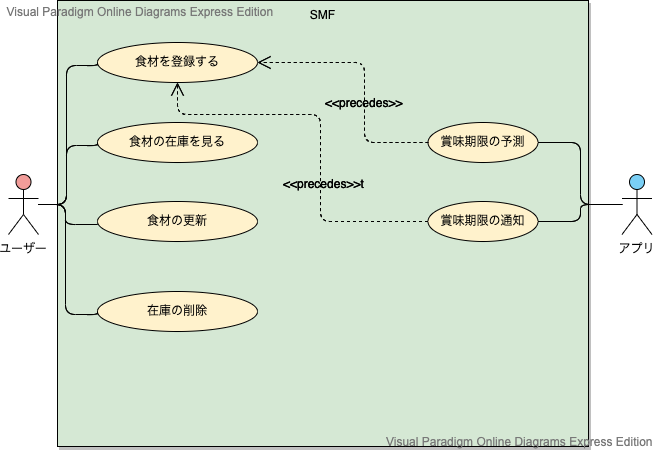

# SMF 実装

## 実装すること
SMFのユースケースは以下である.  
以下のユースケースの2.1 ユーザー用ユースケースを実装する.  
  
### 1. ユースケース図

### 2. ユースケース一覧
#### 2.1 ユーザー用ユースケース
1. [食材を登録する](../usecase/食材登録ユースケース.md)
2. [食材の在庫を見る](../usecase/在庫確認ユースケース.md)
3. [食材の更新](../usecase/usecase_update.md)
4. [在庫の削除](../usecase/usecase_delete.md)

#### 2.2 アプリ用ユースケース
1. [賞味期限を予測する](../usecase/予測ユースケース.md)
2. [賞味期限の通知](../usecase/通知ユースケース.md)  
  
## 役割分担  
実装における役割を以下に示す.  
1. バウンダリ担当：木村  
2. コントローラ・サービス・リポジトリ・エンティティ担当：中井  
3. その他：張本, 長谷川  
